# Database ERD (Entity Relationship Diagram)

**Last Updated:** January 2026

## Visual ERD

The following Mermaid diagram shows the complete database schema and relationships:

```mermaid
erDiagram
    users ||--o{ bookings : "has"
    users ||--o{ reviews : "writes"
    users ||--o{ favorites : "has"
    users ||--o{ payments : "makes"
    users ||--o{ memberships : "has"
    users ||--o{ notifications : "receives"
    users ||--o{ business_members : "is"
    
    business_users ||--o{ venues : "owns"
    business_users ||--o{ business_members : "manages"
    business_users ||--o{ notifications : "receives"
    
    venues ||--o{ bookings : "receives"
    venues ||--o{ reviews : "has"
    venues ||--o{ favorites : "is"
    venues ||--o{ schedules : "has"
    venues ||--o{ memberships : "offers"
    
    bookings ||--o| payments : "has"
    bookings ||--o| reviews : "generates"
    
    memberships ||--o| payments : "has"
    
    users {
        uuid id PK
        varchar email UK
        varchar name
        varchar phone
        varchar country_code
        varchar password_hash
        text avatar
        decimal location_lat
        decimal location_lng
        text location_address
        text_array preferences_categories
        varchar preferences_price_range
        boolean email_verified
        boolean phone_verified
        boolean marketing_consent
        varchar account_status
        int failed_login_attempts
        timestamp locked_until
        timestamp last_login
        timestamp created_at
        timestamp updated_at
        timestamp deleted_at
    }
    
    business_users {
        uuid id PK
        varchar email UK
        varchar business_name
        varchar owner_name
        varchar phone
        varchar country_code
        varchar password_hash
        text avatar
        varchar business_type
        varchar registration_number
        varchar years_in_operation
        text website
        varchar address_street
        varchar address_city
        varchar address_state
        varchar address_postal_code
        varchar address_country
        decimal address_lat
        decimal address_lng
        varchar number_of_locations
        int total_capacity
        text_array specialties
        text service_areas
        varchar account_manager_email
        varchar subscription_tier
        varchar subscription_status
        boolean email_verified
        boolean phone_verified
        boolean business_verified
        varchar verification_status
        varchar account_status
        int failed_login_attempts
        timestamp locked_until
        timestamp last_login
        boolean is_published
        timestamp published_at
        decimal daily_package_price
        decimal weekly_package_price
        decimal monthly_package_price
        timestamp created_at
        timestamp updated_at
        timestamp deleted_at
    }
    
    venues {
        uuid id PK
        uuid business_user_id FK
        varchar name
        varchar category
        text description
        text image
        decimal rating
        int reviews_count
        decimal price
        varchar price_label
        decimal location_lat
        decimal location_lng
        text location_address
        varchar location_city
        text_array amenities
        varchar status
        int occupancy
        int capacity
        boolean verified
        boolean open_now
        jsonb attributes
        jsonb operating_hours
        boolean is_published
        timestamp published_at
        timestamp created_at
        timestamp updated_at
        timestamp deleted_at
    }
    
    bookings {
        uuid id PK
        uuid user_id FK
        uuid venue_id FK
        varchar venue_type
        date booking_date
        time booking_time
        int duration
        varchar status
        decimal total_price
        int attendees
        text special_requests
        varchar payment_status
        varchar payment_id
        timestamp created_at
        timestamp updated_at
        timestamp cancelled_at
        text cancelled_reason
    }
    
    reviews {
        uuid id PK
        uuid user_id FK
        uuid venue_id FK
        uuid booking_id FK
        int rating
        text comment
        int helpful_count
        text business_reply
        timestamp business_reply_date
        timestamp created_at
        timestamp updated_at
        timestamp deleted_at
    }
    
    favorites {
        uuid id PK
        uuid user_id FK
        uuid venue_id FK
        timestamp created_at
    }
    
    notifications {
        uuid id PK
        uuid user_id
        varchar user_type
        varchar type
        varchar title
        text message
        jsonb related_entity
        text action_url
        varchar action_label
        varchar priority
        boolean read
        text_array delivery_channels
        jsonb delivery_status
        timestamp created_at
        timestamp read_at
    }
    
    payments {
        uuid id PK
        uuid user_id FK
        uuid booking_id FK
        uuid venue_id FK
        decimal amount
        varchar currency
        varchar payment_method
        varchar payment_status
        varchar payment_gateway
        varchar transaction_id
        jsonb gateway_response
        timestamp created_at
        timestamp completed_at
        timestamp refunded_at
    }
    
    memberships {
        uuid id PK
        uuid user_id FK
        uuid venue_id FK
        uuid business_user_id FK
        varchar membership_type
        date start_date
        date end_date
        decimal price
        varchar status
        boolean auto_renew
        uuid payment_id FK
        timestamp created_at
        timestamp updated_at
    }
    
    business_members {
        uuid id PK
        uuid business_user_id FK
        uuid user_id FK
        uuid membership_id FK
        timestamp assigned_at
        text notes
        varchar status
    }
    
    schedules {
        uuid id PK
        uuid venue_id FK
        date date
        time time_slot
        int duration
        int total_slots
        int booked_slots
        int available_slots
        boolean is_available
        timestamp created_at
        timestamp updated_at
    }
    
    otps {
        uuid id PK
        varchar email
        varchar otp_code
        varchar otp_type
        timestamp expires_at
        int attempts
        boolean verified
        timestamp created_at
    }
    
    audit_logs {
        uuid id PK
        uuid user_id
        varchar user_type
        varchar action
        varchar resource_type
        uuid resource_id
        varchar ip_address
        text user_agent
        jsonb metadata
        timestamp created_at
    }
```



## Relationship Details

### Primary Relationships

1. **users → bookings** (1:N)
   - One user can have many bookings
   - CASCADE DELETE: When user is deleted, bookings are deleted

2. **users → reviews** (1:N)
   - One user can write many reviews
   - CASCADE DELETE: When user is deleted, reviews are deleted

3. **users → favorites** (1:N)
   - One user can have many favorites
   - CASCADE DELETE: When user is deleted, favorites are deleted

4. **business_users → venues** (1:N)
   - One business can own many venues
   - CASCADE DELETE: When business is deleted, venues are deleted

5. **venues → bookings** (1:N)
   - One venue can have many bookings
   - CASCADE DELETE: When venue is deleted, bookings are deleted

6. **venues → reviews** (1:N)
   - One venue can have many reviews
   - CASCADE DELETE: When venue is deleted, reviews are deleted

7. **bookings → payments** (1:1)
   - One booking can have one payment
   - SET NULL: When booking is deleted, payment booking_id is set to NULL

8. **bookings → reviews** (1:1)
   - One booking can generate one review
   - SET NULL: When booking is deleted, review booking_id is set to NULL

9. **users → memberships** (1:N)
   - One user can have many memberships
   - CASCADE DELETE: When user is deleted, memberships are deleted

10. **venues → memberships** (1:N)
    - One venue can offer many memberships
    - CASCADE DELETE: When venue is deleted, memberships are deleted

11. **venues → schedules** (1:N)
    - One venue can have many schedule entries
    - CASCADE DELETE: When venue is deleted, schedules are deleted

12. **business_users → business_members** (1:N)
    - One business can have many members
    - CASCADE DELETE: When business is deleted, members are removed

13. **users → business_members** (1:N)
    - One user can be a member of many businesses
    - CASCADE DELETE: When user is deleted, memberships are removed

## Indexes

### Performance Indexes

- **users**: email (unique), phone, account_status, email_verified
- **business_users**: email (unique), phone, account_status, business_type, verification_status
- **venues**: business_user_id, category, location_city, location (GIST), status, verified, is_published
- **bookings**: user_id, venue_id, booking_date, status, composite (venue_id, date, time)
- **reviews**: venue_id, user_id, rating
- **favorites**: user_id, venue_id (composite unique)
- **notifications**: user_id + user_type (composite), read (partial), created_at
- **schedules**: venue_id, date, composite (venue_id, date)
- **otps**: email, email + otp_type (composite), expires_at

## Constraints

### Unique Constraints

- `users.email` (with soft delete check)
- `business_users.email` (with soft delete check)
- `favorites(user_id, venue_id)`
- `schedules(venue_id, date, time_slot)`
- `business_members(business_user_id, user_id)`
- `reviews(user_id, venue_id)` (one review per user per venue)

### Check Constraints

- Account status values: `active`, `suspended`, `pending_verification`
- Business type: `gym`, `coaching`, `library`
- Subscription tier: `starter`, `growth`, `enterprise`
- Booking status: `pending`, `confirmed`, `cancelled`, `completed`, `no_show`
- Payment status: `pending`, `paid`, `refunded`, `failed`
- Rating: 1-5 (integer)

## Triggers

1. **update_updated_at_column()**
   - Automatically updates `updated_at` on row update
   - Applied to: users, business_users, venues, bookings, reviews, memberships, schedules

2. **update_venue_rating()**
   - Automatically recalculates venue rating when reviews change
   - Updates `rating` and `reviews_count` in venues table

3. **update_schedule_availability()**
   - Automatically updates schedule availability when bookings change
   - Updates `booked_slots` and `available_slots` in schedules table

## Data Flow

```
User Signup → users table
Business Signup → business_users table
Business Publishes → venues table
User Books → bookings table → schedules (availability updated)
User Reviews → reviews table → venues (rating updated)
User Favorites → favorites table
Payment → payments table → bookings (payment_status updated)
Membership → memberships table → business_members
Notifications → notifications table (triggered by various events)
```

---

**For database schema details, see [Complete Schema Documentation](./complete-schema.md)**
